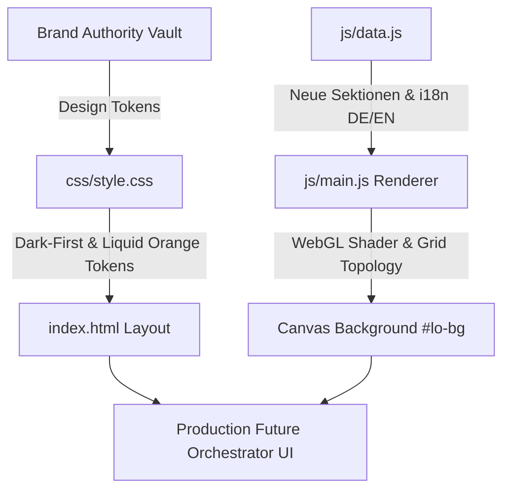

# CV_IT_KKEEY — Future Orchestrator Interface: Walkthrough

## Übersicht

Die IT-Portfolio-Website [CV_IT_KKEEY](file:///Users/kevinkuck/Workspace/Freelance_Repos/CV_IT_KKEEY) wurde von einem statischen, hellen Basis-CV in ein vollwertiges, dark-first **„Future Orchestrator" Kontrollraum-Interface (Ästhetik 2030)** nach dem **KKEEY Liquid Orange Brand Standard v1.0** transformiert.

---

## Durchgeführte Änderungen

### 1. Design Token System ([css/style.css](file:///Users/kevinkuck/Workspace/Freelance_Repos/CV_IT_KKEEY/css/style.css))
- **Brand Tokens**: Liquid Orange (`#FF7A00`, `#FF9A3C`, `rgba(255,122,0,0.1)`), Graphite (`#0C0D0F`), Anthracite (`#131518`), Steel (`#4B5563`).
- **Keine Legacy-Blau-Werte mehr**: Vollständige Bereinigung der alten `#1a5fa8` Blueprint-Farbpalette.
- **Glassmorphism & Surface Elevation**: Backdrop-Blur, feine Orange-Accent-Borders und obere Verlaufsakzente auf allen Cards.
- **Accessibility & Motion**: `@media (prefers-reduced-motion: reduce)` und print-optimiertes Black-on-White Stylesheet.

### 2. Dynamischer WebGL Shader-Hintergrund ([js/main.js](file:///Users/kevinkuck/Workspace/Freelance_Repos/CV_IT_KKEEY/js/main.js))
- **Topologie-Grid & Node-Pulse**: Dynamischer Fragment-Shader mit Graphite/Anthracite Tiefenverlauf, orthogonalen Netzlinien und wandernden Liquid-Orange-Energie-Impulsen.
- **Scroll-Reaktivität**: Subtile Intensitätsanpassung und Parallaxe beim Scrollen.
- **Performance Guard**: Full-Screen-Quad Rendering mit GPU-Fokus und Fallback-Handling.

### 3. Datenarchitektur & Mehrsprachigkeit ([js/data.js](file:///Users/kevinkuck/Workspace/Freelance_Repos/CV_IT_KKEEY/js/data.js))
- **Neue Sektionen**:
  - `overview`: 6 Enterprise-IT-Domänen (Cloud/Hybrid, On-Prem, Automation, Security, Monitoring, Governance)
  - `systems`: Architektur & Stack-Tiers
  - `automation`: 5-stufige Orchestrierungs-Pipeline & Agentic UI-Elemente
  - `compliance`: Audit-Bereitschaft (KRITIS, IAM, Endpoint, KKEEY-Standard)
  - `impact`: 3 datengetriebene Case-Stories (90k+ AD-Objekte, 14 Jahre Praxis, strukturierte Diagnose)
- **Vollständiges Bilingual-System**: Alle Texte nahtlos umschaltbar zwischen DE und EN.

### 4. Semantisches HTML & ARIA ([index.html](file:///Users/kevinkuck/Workspace/Freelance_Repos/CV_IT_KKEEY/index.html))
- Semantische HTML5-Struktur (`role="banner"`, `role="main"`, `role="navigation"`, `role="contentinfo"`).
- Skip-to-Content Link für Tastatur-Navigation.
- Live-Status-Indikatoren (`aria-live="polite"`).

---

## Verifikationsergebnisse

| Test | Ergebnis | Status |
|---|---|---|
| **Node.js Syntax-Check** | `node -c js/data.js && node -c js/main.js` | Erledigt (Exit Code 0) |
| **HTTP Auslieferung** | Server liefert HTML, CSS, data.js, main.js via HTTP 200 OK | Erledigt |
| **Git-Commit** | `02da86b: feat(ui): implement KKEEY Liquid Orange Future Orchestrator interface...` | Erledigt |

---

## Nächste Schritte

- Lokale Live-Vorschau ist unter `http://localhost:8085` aktiv.
- Sobald freigegeben, kann der Branch mit `git push` zu GitHub (`origin/main`) übertragen werden, wodurch GitHub Pages automatisch aktualisiert wird.
