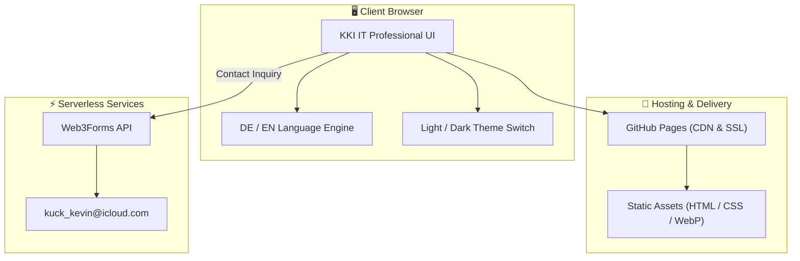

# CV_IT_KKEEY: Enterprise IT Administration & IAM Engineering

<div align="center">
  
  <h3>Kevin Kuck — IT Administrator & System Engineer</h3>
  
  [](https://kkeey92.github.io/CV_IT_KKEEY/)
  []()
  []()
  []()
</div>

---

## 🇩🇪 Deutsch

### Über dieses Repository
Dieses Repository beherbergt das interaktive IT-Administrator-Portfolio von **Kevin Kuck**. Es demonstriert fundierte 15 Jahre praktische Betriebserfahrung in der Verwaltung komplexer Enterprise-IT-Infrastrukturen, Identity & Access Management (Active Directory, Microsoft Entra ID), Citrix-Farmen, Windows 11 Rollouts, PowerShell-Automatisierung und KRITIS-Infrastrukturen.

### Kernkompetenzen & Schwerpunkte
- 🔐 **Identity & Access Management (IAM):** Active Directory, Microsoft Entra ID (Azure AD), SSO, MFA, Rollen- & Berechtigungskonzepte (RBAC).
- 🖥️ **Systemverwaltung & Virtualisierung:** Citrix Virtual Apps & Desktops, Windows Server 2016-2022, Windows 11 Enterprise Rollouts.
- ⚡ **Automatisierung:** PowerShell-Skripting für Benutzer-Lifecycle, AD-Audits und Systemkonfigurationen.
- 🛡️ **IT-Sicherheit & KRITIS:** Betriebsführung nach BSI-Grundschutz und ISO 27001 Vorgaben in sensiblen Infrastrukturen.
- 🔒 **DSGVO & DDG Compliance:** Vollständig integrierte Seiten für Impressum (§ 5 DDG) und Datenschutz (Art. 13 DSGVO).

---

## 🇬🇧 English

### Overview
This repository hosts the interactive IT System Administration portfolio of **Kevin Kuck**. It showcases 15 years of hands-on enterprise IT experience managing complex infrastructures, Identity & Access Management (Active Directory, Microsoft Entra ID), Citrix virtualization environments, Windows 11 Enterprise rollouts, PowerShell automation, and critical infrastructure (KRITIS) security standards.

### Core Technical Focus
- 🔐 **Identity & Access Management (IAM):** Active Directory, Microsoft Entra ID (Azure AD), SSO, MFA, RBAC permission matrix enforcement.
- 🖥️ **Systems Administration & Virtualization:** Citrix Virtual Apps & Desktops, Windows Server 2016-2022, Windows 11 Enterprise migrations.
- ⚡ **Automation:** Production PowerShell scripting for automated user lifecycle provisioning, AD auditing, and policy enforcement.
- 🛡️ **IT Security & Governance:** Operations aligned with BSI-IT-Grundschutz and ISO 27001 standards in critical infrastructure sectors.
- 🔒 **Legal & Privacy Compliance:** Built-in legal notice (Impressum) and GDPR-compliant privacy policy.

---

## 🏗 Systemarchitektur / System Architecture



---

## 🛠 Local Development & Testing

```bash
# 1. Repository klonen / Clone repo
git clone https://github.com/KKEEY92/CV_IT_KKEEY.git
cd CV_IT_KKEEY

# 2. Lokalen Webserver starten / Start local webserver
python3 -m http.server 3000

# 3. Im Browser öffnen / Open in browser
# http://localhost:3000
```

---

## 💼 Freelance & Contact Information

**Kevin Kuck** — *IT Administrator & System Engineer*  
Available for IT administration contracts, IAM architecture, PowerShell automation, and infrastructure projects.

- 🌐 **Live Portfolio:** [kkeey92.github.io/CV_IT_KKEEY/](https://kkeey92.github.io/CV_IT_KKEEY/)
- 👔 **LinkedIn:** [linkedin.com/in/kevin-kuck-it/](https://www.linkedin.com/in/kevin-kuck-it/)
- 🦊 **GitLab:** [gitlab.com/KKEEY92](https://gitlab.com/KKEEY92)
- 🐙 **GitHub:** [github.com/KKEEY92](https://github.com/KKEEY92)

---
&copy; 2026 Kevin Kuck. All rights reserved. / Alle Rechte vorbehalten.
